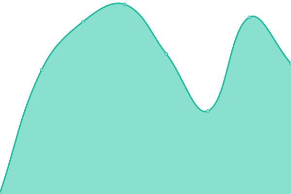
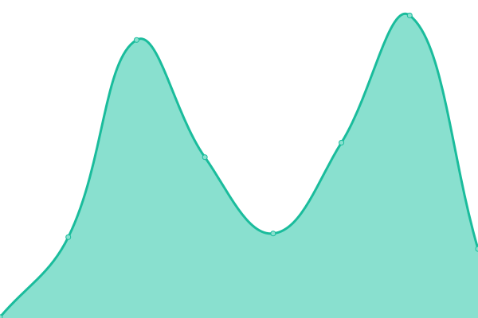
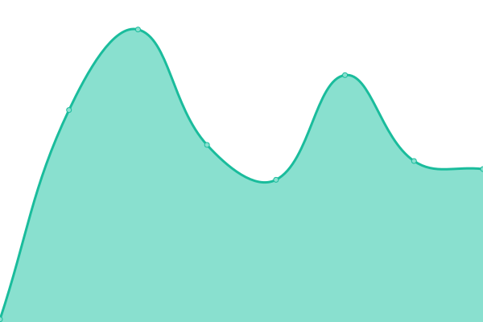
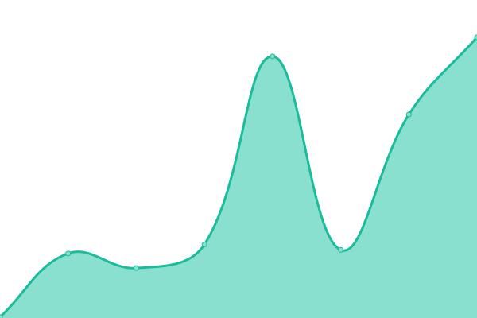

# [📈 Live Status](https://status.restent.win): <!--live status--> **🟩 All systems operational**

This repository contains the open-source uptime monitor and status page for [Sliver Complex](https://network.restent.win), powered by [Upptime](https://github.com/upptime/upptime).

With [Upptime](https://upptime.js.org), you can get your own unlimited and free uptime monitor and status page, powered entirely by a GitHub repository. We use [Issues](https://github.com/S-Complex/upptime/issues) as incident reports, [Actions](https://github.com/S-Complex/upptime/actions) as uptime monitors, and [Pages](https://status.restent.win) for the status page.

<!--start: status pages-->
<!-- This summary is generated by Upptime (https://github.com/upptime/upptime) -->
<!-- Do not edit this manually, your changes will be overwritten -->
<!-- prettier-ignore -->
| URL | Status | History | Response Time | Uptime |
| --- | ------ | ------- | ------------- | ------ |
|  [Homepage](https://www.gxres.net) | 🟩 Up | [homepage.yml](https://github.com/s-complex/upptime/commits/HEAD/history/homepage.yml) | 

 165ms
     
 | 

<a href="https://status.slirv.vip/history/homepage">100.00%</a>
    

|  [Blog](https://blog.gxres.net) | 🟩 Up | [blog.yml](https://github.com/s-complex/upptime/commits/HEAD/history/blog.yml) | 

 138ms
     
 | 

<a href="https://status.slirv.vip/history/blog">100.00%</a>
    

|  [Library](https://library.gxres.net) | 🟩 Up | [library.yml](https://github.com/s-complex/upptime/commits/HEAD/history/library.yml) | 

 191ms
     
 | 

<a href="https://status.slirv.vip/history/library">100.00%</a>
    

|  [Hyperlink Redirect](https://link.gxres.net) | 🟩 Up | [hyperlink-redirect.yml](https://github.com/s-complex/upptime/commits/HEAD/history/hyperlink-redirect.yml) | 

 218ms
     
 | 

<a href="https://status.slirv.vip/history/hyperlink-redirect">100.00%</a>
    

|  [Sliver Complex](https://slirv.vip) | 🟩 Up | [sliver-complex.yml](https://github.com/s-complex/upptime/commits/HEAD/history/sliver-complex.yml) | 

 349ms
     
 | 

<a href="https://status.slirv.vip/history/sliver-complex">100.00%</a>
    

|  [R2 Storage](https://r2.slirv.vip/index.html) | 🟩 Up | [r2-storage.yml](https://github.com/s-complex/upptime/commits/HEAD/history/r2-storage.yml) | 

 602ms
     
 | 

<a href="https://status.slirv.vip/history/r2-storage">0.55%</a>
    

|  [API](https://api.slirv.vip) | 🟩 Up | [api.yml](https://github.com/s-complex/upptime/commits/HEAD/history/api.yml) | 

 206ms
     
 | 

<a href="https://status.slirv.vip/history/api">100.00%</a>
    

|  [Upptime](https://status.slirv.vip) | 🟩 Up | [upptime.yml](https://github.com/s-complex/upptime/commits/HEAD/history/upptime.yml) | 

 188ms
     
 | 

<a href="https://status.slirv.vip/history/upptime">100.00%</a>
    

|  [Artalk](https://artalk.slirv.vip) | 🟩 Up | [artalk.yml](https://github.com/s-complex/upptime/commits/HEAD/history/artalk.yml) | 

 893ms
     
 | 

<a href="https://status.slirv.vip/history/artalk">100.00%</a>
    

|  [Umami](https://umami.slirv.vip) | 🟩 Up | [umami.yml](https://github.com/s-complex/upptime/commits/HEAD/history/umami.yml) | 

 526ms
     
 | 

<a href="https://status.slirv.vip/history/umami">100.00%</a>
    

<!--end: status pages-->

[**Visit our status website →**](https://status.restent.win)

## 📄 License

- Powered by: [Upptime](https://github.com/upptime/upptime)
- Code: [MIT](./LICENSE) © [Sliver Complex](https://network.restent.win)
- Data in the `./history` directory: [Open Database License](https://opendatacommons.org/licenses/odbl/1-0/)
